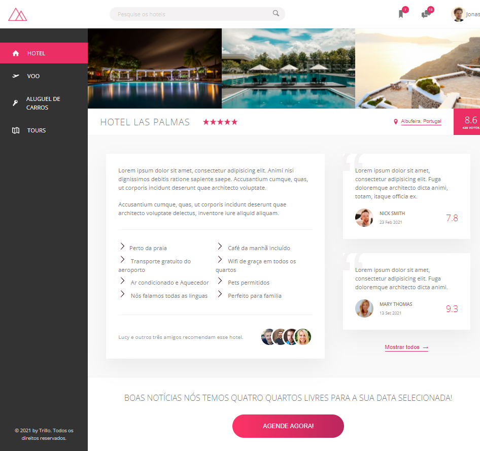
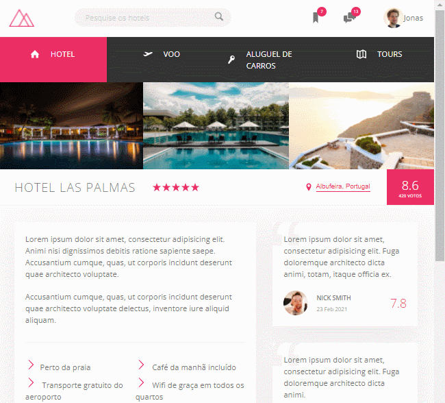

<h1 align="center"> TRILLO </h1>

# Indice

- [ Versão desktop ](#Versão-desktop)
- [ Versão Mobile ](#Versão-Mobile)
- [ Demonstração ](#Demonstração)
- [ About ](#-About)
- [ Tecnologias utilizadas ](#-Tecnologias-utilizadas)
- [ Como baixar o projeto ](#-Baixar-o-projeto)

---

### Versão desktop
<h1> 
     
</h1>

### Versão Mobile
<h1> 
     
</h1>

### Demonstração
<h1> 
     
</h1>

### 🌴 About

Aplicação com foco em flexbox

---
### 🚀 Tecnologias utilizadas 

O projeto foi desenvolvido utilizando as seguintes tecnologias

- html
- css avançado [ animações, pseudoelementos, transform, transition, variaveis, flexbox ]
- sass [ mixins, variaveis, funções ]

---
### 📂 Baixar o projeto 

```bash
    # Clonar o repositório
    $ git clone https://github.com/IsabelyDev/Trillo

    # Entrar no diretório do projeto
    $ cd Trillo

```

---
Desenvolvido 💜  por Isabely Oliveira 
